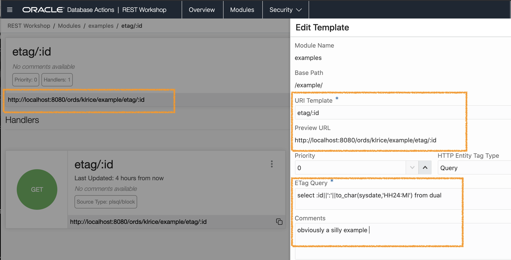
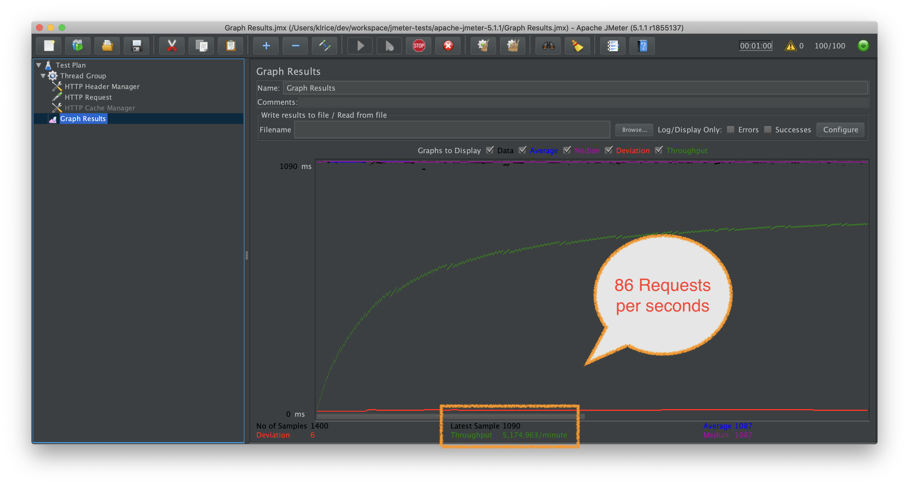
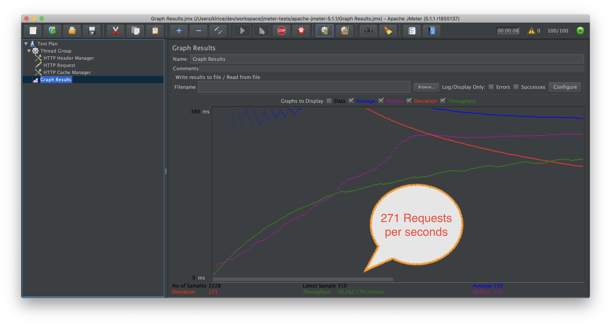

# ORDS and ETAGs
Colm [blogged](https://cdivilly.wordpress.com/2014/10/31/oracle-rest-data-services-entity-tags/) long ago about what ORDS has for support on ETags. Given some usage we are seeing in Autonomous Database, it's a great time to revisit this with an angle on performance.  There's nothing new in this space so Colm's blog is still accurate but I'll summarize here also.

## ORDS options for ETags.


### Secure Hash
This is the **default**. What happens here is ORDS computes a hash over the entire payload being served by the REST endpoing. That makes this the most accurate as it's using the exact payload. This also means ORDS has an overhead to computing the hash.

### Query
The query option allows for custom sql to determine if a REST resource has been changed since the last time the client retrieved it. The main benefit here is to avoid the main query/source and the hashing of it all together. Since the control is now in the definition of this sql query something like a column with `update_date` or `row_version_number` can be used as the indicator that the resource has changed.  ORDS will execute this etag-query and compute the HASH over the results of this query. This can be a huge saving in time if the main query/REST API takes time

### None 
```
ORA-200001: No ETAG generated
Cause: Obvious
Action: None
```

## Flow of the ETAG

Here's a simplitic diagram of the flow. The far right boxes indicate the work that ORDS has to perform and that is where the most impact of using the proper ETAG option for this REST endpoint will be seen.

```
+---------+                                            +-------+
| Browser |                                            | ORDS  |
+---------+                                            +-------+
     |                                                     |
     | Get me my resource                                  |
     |---------------------------------------------------->|
     |                                                     | --------------------------\
     |                                                     |-| Query DB + Compute ETAG |
     |                                                     | |-------------------------|
     |                                                     |
     |                       Gladly with this ETAG: 123456 |
     |<----------------------------------------------------|
     |                                                     |
     | Get me my again resource: If-None-Match: 123456     |
     |---------------------------------------------------->|
     |                                                     | -------------------------\
     |                                                     |-| Compute ETAG and match |
     |                                                     | |------------------------|
     |                                                     |
     |                                   304: Not Modified |
     |<----------------------------------------------------|
     |                                                     |
     | Get me my again resource: If-None-Match: 123456     |
     |---------------------------------------------------->|
     |                                                     | ---------------------------\
     |                                                     |-| Compute ETAG and differs |
     |                                                     | | execute main REST source |
     |                                                     | |--------------------------|
     |                       Gladly with this ETAG: 456789 |
     |<----------------------------------------------------|
     |                                                     |
```

## Impact of Choices

To show the impact of the choices here's the most trivial example I can use.


### ORDS REST endpoint

The REST Source is PL/SQL creating a payload of simply the :ID passed in and the to the minute time. 

The ORDS full path being `http://localhost:8080/ords/klrice/example/etag/:id`

```
begin
   -- something much scarier should go here.
   dbms_lock.sleep(1);
   htp.p(:id ||':'||to_char(sysdate,'HH24:MI'));
end;
```

### Etag: Query

The query making up this etag mirrors the source but in practice it could be some sql such as `select update_dt from mytable where id = :id`



### My setup

 This test is on my laptop
 
*  	Database:  Oracle 19 in a docker from [Oracle's Container Registry](https://container-registry.oracle.com/)
*  	ORDS : local build with a connection pool max=200
*  JMeter set to use 100 threads on same machine
*  Zoom is running along with all other normal things
 	

### Test with no-etag

Remember the source has a 1 second sleep when executing the real REST source to simulate some real work vs this trivial example.

This is the results of running with no ETAG support in the client.




### Test with ETag

This is the results of running with JMeter's Cache Control support enabled which means ETAG are sent back for Nth request




### TL;DR

Use Query ETAGs whenever a client is going to be getting the same resource. This will skip the main source from being run.