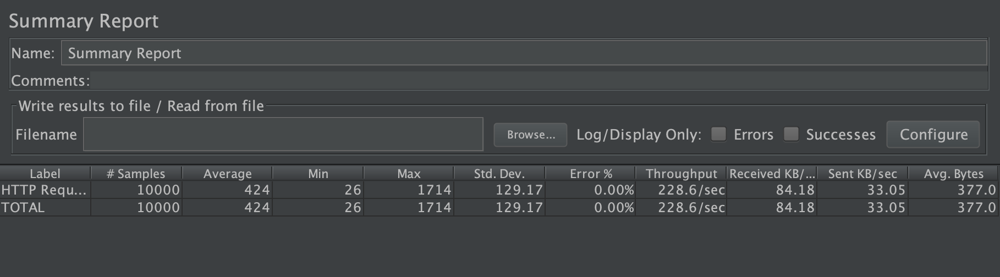
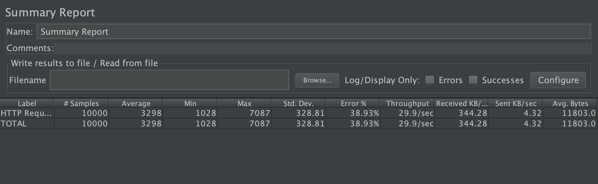

## The Good

Maybe the best feature that ORDS + APEX combo bring is the multi-application , multi-tennanted nature of their design. A single install of ORDS can service any number of databases. There are ORDS nodes I know of which have 1000s of databases being serviced. This brings operational challenges with things like high avilabity, patching,.. and it just works.  Each of these databases have an install of APEX and as many APEX applications can be built and it just works. So from idea to rolling out any number of applications is only limited by how fast the idea can be codified.

## The Bad

This same feature of multi-database , multi-application can cause a resource starvation quite easily. Consider the very simple architecture of how all this works.

ORDS gets a requests, gets a db connection, runs it and returns the results. Simple.

```
+---------+                +-------+                        +-----+
| Browser |                | ORDS  |                        | DB  |
+---------+                +-------+                        +-----+
     |                         |                               |
     | Process my request      |                               |
     |------------------------>|                               |
     |                         | ---------------------------\  |
     |                         |-| Get connection from pool |  |
     |                         | |--------------------------|  |
     |                         |                               |
     |                         | Execute SQL/PLSQL             |
     |                         |------------------------------>|
     |                         |                               |
     |                         |                      All done |
     |                         |<------------------------------|
     |                         |                               |
     |             Here you go |                               |
     |<------------------------|                               |
     |                         |                               |
```

The trouble comes in when the finite resource of a pool of connections get starved. Now carry this forward to having a deployment of ORDS/APEX when there are N applications and N REST endpoints. If 1 of these has less than good performance or causes something like a deadlock, there's impact on ALL things serviced from that same connection pool. 

ORDS has no stateful information which means all state from call to call is maintained in the DB including of course APEX. The impact of this is that every call to APEX is infact a transaction at least to APEX's session state , logging, debugging, or the application itself of course. There is no read only. This also means these write themselves can become a bottleneck at greater scales.

### Example

Let's take a trivial REST end point to show the impact of performance on my local DB+ORDS. 

This test is on my laptop
 
*  	Database:  Oracle 19 in a docker from [Oracle's Container Registry](https://container-registry.oracle.com/)
*  	ORDS : local build with a connection **pool max=20**
*  JMeter set to use 100 threads on same machine
*  Zoom is running along with all other normal things that zap resources
 	

URL: http://localhost:8080/ords/klrice/example/code-impact/:timer

With a source of the following

```
begin
    if :timer is not null and :timer != 0 then
        dbms_lock.sleep(:timer);
    end if;
    htp.p(to_char(systimestamp,'HH24:MI:SS.SSxFF'));
end;

```

#### Test 1 : ZERO for a timer

URL: URL: http://localhost:8080/ords/klrice/example/code-impact/0

Using jmeter the test is 100 threads for 100 loops.



#### Test 2 : 1 second for a timer

The exaact same test but instead of passing a 0 it will use a 1.

URL: URL: http://localhost:8080/ords/klrice/example/code-impact/1

Just a 1 second of think time results in starvation of 20 connections in the pool. This can be seems quite prominantly in the 38% error rate.  The error that would be seen in the logs is `Caused by: oracle.ucp.UniversalConnectionPoolException: All connections in the Universal Connection Pool are in use` and the end user would be getting `HTTP 500 messages`




## Options

### More Power

There's a few things that can be done to avoid this resource starvation. The simpliest being larger pools, more machines, larger database. Essentially, MORE POWER.


Well, it's never that easy. There's a series on why more connections isn't always a good thing [here](https://www.youtube.com/watch?v=XzN8Rp6glEo). 

### Bifurcation

Recently, we had to deal with the same question on systems we have built. The answer for us was to bifurcate the traffic. There as a loadbalancer placed in front of a fleet ORDS nodes and partitioned the traffic depending on the APEX Application ID and the ORDS REST end points. This made is such that if a connection pool was starved out by application 1 that application 2 could continue to run. In this case the 2 applications were in the same database but different schemas so there was no chance of each application's logic ( bad code ) impacting the other inside the database. This may not help at all if the 2 applications are accessing the each same transaction tables where a database deadlock could happen.

The architecture looks something like this now.

```
+---------+          +-----+                  +-------+                                                         +-----+
| Browser |          | LBR |                  | ORDS1 |                                                         | DB  |
+---------+          +-----+                  +-------+                                                         +-----+
     |                  |                         |                                                                |
     | Application 1    |                         |                                                                |
     |----------------->|                         |                                                                |
     |                  |                         |                                                                |
     |                  | Process my request      |                                                                |
     |                  |------------------------>|                                                                |
     |                  |                         | ---------------------------\                                   |
     |                  |                         |-| Get connection from pool |                                   |
     |                  |                         | |--------------------------|                                   |
     |                  |                         |                                                                |
     |                  |                         | Execute SQL/PLSQL                                              |
     |                  |                         |--------------------------------------------------------------->|
     |                  |                         |                                                                |
     |                  |                         |                                                       All done |
     |                  |                         |<---------------------------------------------------------------|
     |                  |                         |                                                                |
     |                  |             Here you go |                                                                |
     |<-------------------------------------------|                                                                |
     |                  |                         |                                                                |
     | Application 2    |                         |                             +-------+                          |
     |----------------->|                         |                             | ORDS2 |                          |
     |                  |                         |                             +-------+                          |
     |                  | Process my request      |                                |                               |
     |                  |------------------------>|                                |                               |
     |                  |                         |                                | ---------------------------\  |
     |                  |                         |                                |-| Get connection from pool |  |
     |                  |                         |                                | |--------------------------|  |
     |                  |                         |                                |                               |
     |                  |                         |                                | Execute SQL/PLSQL             |
     |                  |                         |                                |------------------------------>|
     |                  |                         |                                |                               |
     |                  |                         |                                |                      All done |
     |                  |                         |                                |<------------------------------|
     |                  |                         |                                |                               |
     |                  |                         |                    Here you go |                               |
     |<----------------------------------------------------------------------------|                               |
     |                  |                         |                                |                               |
```     

## Summary

The take away here is simply to think over deployment strategies as applications become more and more mission critical and to ask yourself questions. 

* Where would resource starvation happen in your deployment ?
* When there are N applications in a single stack is it okay if 1 goes rogue and impacts the others? 
* How much application isolation is needed? 
* When is it enough isolation enough? 
* Is the performance monitored?
* Could an easier feature like Resource Manager work ?
